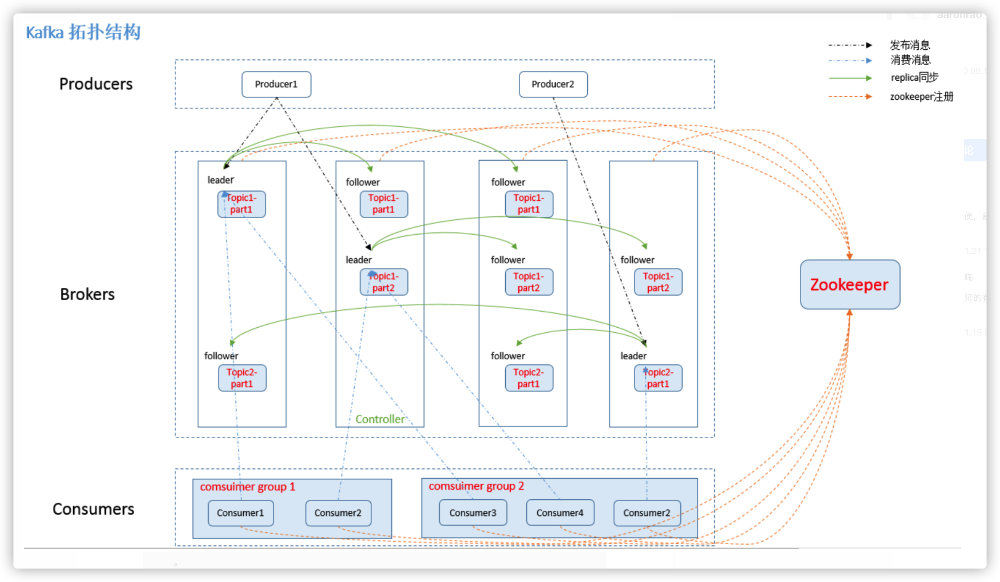
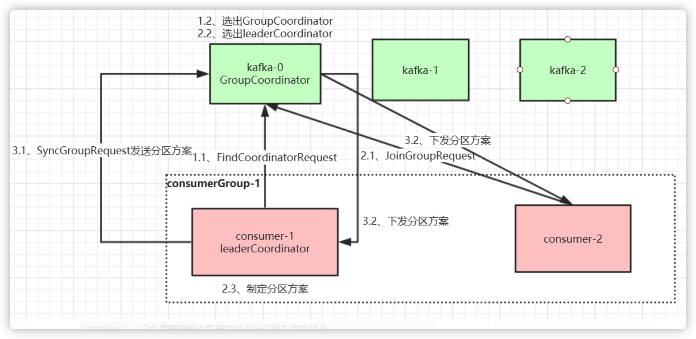
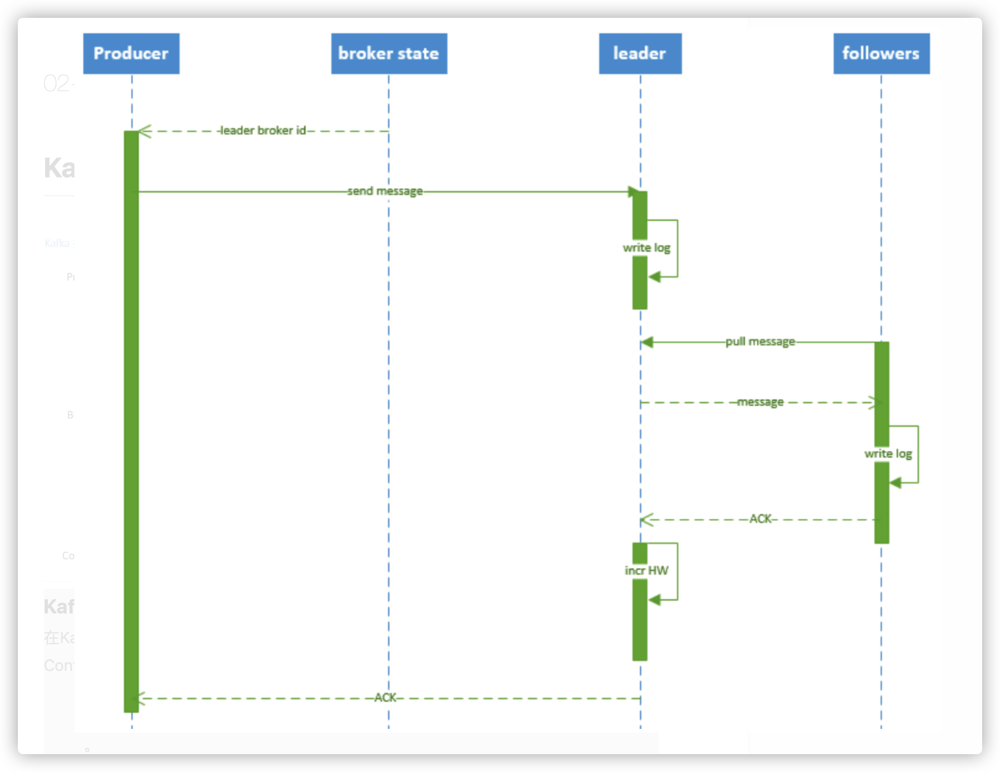
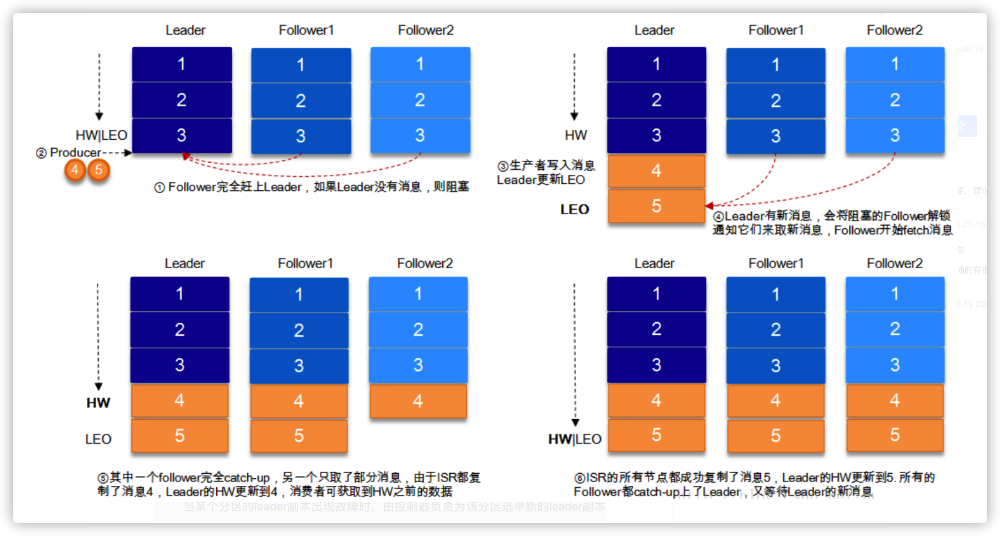
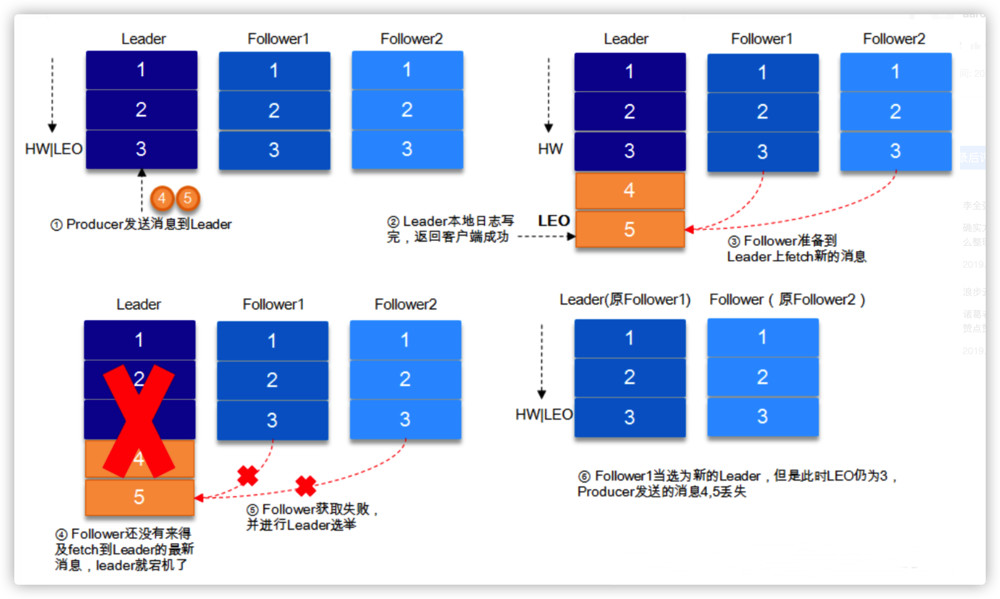
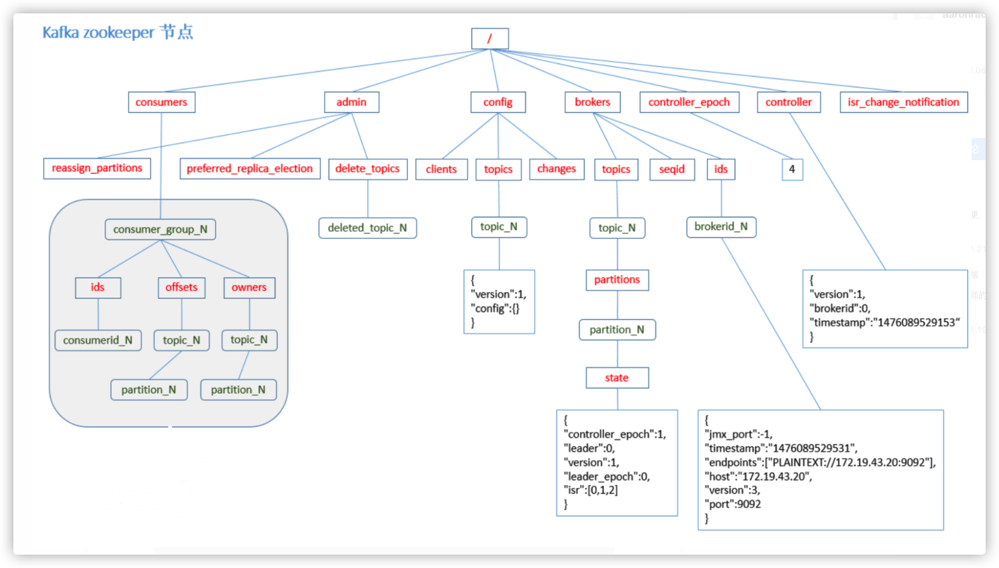

# Kafka设计原理详解

## 1. Kafka拓扑结构



### 1.1 Kafka核心总控制器Controller

在Kafka集群中会有一个或者多个broker，其中有一个broker会被选举为控制器（Kafka Controller），它负责管理整个集群中所有分区和副本的状态。

- 当某个分区的leader副本出现故障时，由控制器负责为该分区选举新的leader副本。
- 当检测到某个分区的ISR集合发生变化时，由控制器负责通知所有broker更新其元数据信息。
- 当使用kafka-topics.sh脚本为某个topic增加分区数量时，同样还是由控制器负责让新分区被其他节点感知到。

## 1.2 Controller选举机制

在kafka集群启动的时候，会自动选举一台broker作为controller来管理整个集群，选举的过程是集群中每个broker都会尝试在zookeeper上创建一个 **/controller 临时节点**，zookeeper会保证有且仅有一个broker能创建成功，这个broker就会成为集群的总控器controller。

 当这个controller角色的broker宕机了，此时zookeeper临时节点会消失，集群里其他broker会一直监听这个临时节点，发现临时节点消失了，就竞争再次创建临时节点，就是我们上面说的选举机制，zookeeper又会保证有一个broker成为新的controller。

具备控制器身份的broker需要比其他普通的broker多一份职责，具体细节如下：

1. **监听broker相关的变化**。为Zookeeper中的/brokers/ids/节点添加BrokerChangeListener，用来处理broker增减的变化。
2. 监听topic相关的变化。为Zookeeper中的/brokers/topics节点添加TopicChangeListener，用来处理topic增减的变化；为Zookeeper中的/admin/delete_topics节点添加TopicDeletionListener，用来处理删除topic的动作。
3. 从Zookeeper中读取获取当前所有与topic、partition以及broker有关的信息并进行相应的管理。对于所有topic所对应的Zookeeper中的/brokers/topics/[topic]节点添加PartitionModificationsListener，用来监听topic中的分区分配变化。
4. 更新集群的元数据信息，同步到其他普通的broker节点中。

### 1.3 Partition副本选举Leader机制

controller感知到分区leader所在的broker挂了(controller监听了很多zk节点可以感知到broker存活)，controller会从每个parititon的 replicas 副本列表中取出第一个broker作为leader，当然这个broker需要也同时在ISR列表里。

### 1.4 消费者消费消息的offset记录机制

每个consumer会定期将自己消费分区的offset提交给kafka内部topic：**__consumer_offsets**，提交过去的时候，**key是consumerGroupId+topic+分区号，value就是当前offset的值**，kafka会定期清理topic里的消息，最后就保留最新的那条数据

 因为__consumer_offsets可能会接收高并发的请求，kafka默认给其**分配50个分区**(可以通过offsets.topic.num.partitions设置)，这样可以通过加机器的方式抗大并发。

#消费者Rebalance机制**

消费者rebalance就是说如果consumer group中某个消费者挂了，此时会自动把分配给他的分区交给其他的消费者，如果他又重启了，那么又会把一些分区重新交还给他。

**注意：**rebalance只针对subscribe这种不指定分区消费的情况，如果通过assign这种消费方式指定了分区，kafka不会进行rebanlance。

如下情况可能会触发消费者rebalance

1. consumer所在服务重启或宕机了
2. 动态给topic增加了分区
3. 消费组订阅了更多的topic

### 1.5 Rebalance

当有消费者加入消费组时，消费者、消费组及组协调器之间会经历以下几个阶段。

#### 第一阶段：选择组协调器

**组协调器GroupCoordinator**：每个consumer group都会选择一个broker作为自己的组协调器coordinator，负责监控这个消费组里的所有消费者的心跳，以及判断是否宕机，然后开启消费者rebalance。

consumer group中的每个consumer启动时会向kafka集群中的某个节点发送 FindCoordinatorRequest 请求来查找对应的组协调器GroupCoordinator，并跟其建立网络连接。

**组协调器选择方式**：

通过如下公式可以选出consumer消费的offset要提交到__consumer_offsets的哪个分区，这个分区leader对应的broker就是这个consumer group的coordinator

公式：**hash(consumer group id) % __consumer_offsets主题的分区数**

#### 第二阶段：加入消费组（JOIN GROUP）

在成功找到消费组所对应的 GroupCoordinator 之后就进入加入消费组的阶段，在此阶段的消费者会向 GroupCoordinator 发送 JoinGroupRequest 请求，并处理响应。然后GroupCoordinator 从一个consumer group中选择第一个加入group的consumer作为leader(**消费组协调器**)，把consumer group情况发送给这个leader，接着这个leader会负责制定分区方案。

#### 第三阶段（SYNC GROUP）

consumer leader通过给GroupCoordinator发送SyncGroupRequest，接着GroupCoordinator就把分区方案下发给各个consumer，他们会根据指定分区的leader broker进行网络连接以及消息消费。



### 1.6 消费者Rebalance分区分配策略

主要有三种rebalance的策略：range、round-robin、sticky。

Kafka 提供了消费者客户端参数partition.assignment.strategy 来设置消费者与订阅主题之间的分区分配策略。默认情况为range分配策略。

假设一个主题有10个分区(0-9)，现在有三个consumer消费：

**range策略**就是按照分区序号排序，假设 n＝分区数／消费者数量 = 3， m＝分区数%消费者数量 = 1，那么前 m 个消费者每个分配 n+1 个分区，后面的（消费者数量－m ）个消费者每个分配 n 个分区。

比如分区0~3给一个consumer，分区4~6给一个consumer，分区7~9给一个consumer。

**round-robin策略**就是轮询分配，比如分区0、3、6、9给一个consumer，分区1、4、7给一个consumer，分区2、5、8给一个consumer

**sticky策略**就是在rebalance的时候，需要保证如下两个原则。

- 分区的分配要尽可能均匀 。

- 分区的分配尽可能与上次分配的保持相同。

当两者发生冲突时，第一个目标优先于第二个目标 。这样可以最大程度维持原来的分区分配的策略。

比如对于第一种range情况的分配，如果第三个consumer挂了，那么重新用sticky策略分配的结果如下：

consumer1除了原有的0~3，会再分配一个7

consumer2除了原有的4~6，会再分配8和9


## 2. producer发布消息机制剖析

### 2.1 写入方式

producer 采用 push 模式将消息发布到 broker，每条消息都被 append 到 patition 中，属于顺序写磁盘（顺序写磁盘效率比随机写内存要高，保障 kafka 吞吐率）。

### 2.2 消息路由

producer 发送消息到 broker 时，会根据分区算法选择将其存储到哪一个 partition。其路由机制为：

- 指定了 patition，则直接使用；
- 未指定 patition 但指定 key，通过对 key 的 value 进行hash 选出一个 patition
- patition 和 key 都未指定，使用轮询选出一个 patition。

### 2.3 写入流程



- producer 先从 zookeeper 的 "/brokers/.../state" 节点找到该 partition 的 leader
- producer 将消息发送给该 leader
- leader 将消息写入本地 log
- followers 从 leader pull 消息，写入本地 log 后 向leader 发送 ACK
- leader 收到所有 ISR 中的 replica 的 ACK 后，增加 HW（high watermark，最后 commit 的 offset） 并向 producer 发送 ACK


## 3. HW与LEO详解

HW俗称高水位，HighWatermark的缩写，取一个partition对应的ISR中最小的LEO(**log-end-offset**)作为HW，consumer最多只能消费到HW所在的位置。另外每个replica都有HW,leader和follower各自负责更新自己的HW的状态。对于leader新写入的消息，consumer不能立刻消费，leader会等待该消息被所有ISR中的replicas同步后更新HW，此时消息才能被consumer消费。这样就保证了如果leader所在的broker失效，该消息仍然可以从新选举的leader中获取。对于来自内部broker的读取请求，没有HW的限制。

下图详细的说明了当producer生产消息至broker后，ISR以及HW和LEO的流转过程：



由此可见，Kafka的复制机制既不是完全的同步复制，也不是单纯的异步复制。事实上，同步复制要求所有能工作的follower都复制完，这条消息才会被commit，这种复制方式极大的影响了吞吐率。而异步复制方式下，follower异步的从leader复制数据，数据只要被leader写入log就被认为已经commit，这种情况下如果follower都还没有复制完，落后于leader时，突然leader宕机，则会丢失数据。而Kafka的这种使用ISR的方式则很好的均衡了确保数据不丢失以及吞吐率。再回顾下消息发送端对发出消息持久化机制参数acks的设置，我们结合HW和LEO来看下acks=1的情况

**结合HW和LEO看下 acks=1的情况**




## 4. 日志分段存储

Kafka 一个分区的消息数据对应存储在一个文件夹下，以topic名称+分区号命名，kafka规定了一个分区内的 .log 文件最大为 1G，做这个限制目的是为了方便把 .log 加载到内存去操作：

```
# 部分消息的offset索引文件，kafka每次往分区发4K(可配置)消息就会记录一条当前消息的offset到index文件，
# 如果要定位消息的offset会先在这个文件里快速定位，再去log文件里找具体消息
00000000000000000000.index
# 消息存储文件，主要存offset和消息体
00000000000000000000.log
# 消息的发送时间索引文件，kafka每次往分区发4K(可配置)消息就会记录一条当前消息的发送时间戳与对应的offset到timeindex文件，
# 如果需要按照时间来定位消息的offset，会先在这个文件里查找
00000000000000000000.timeindex

00000000000005367851.index
00000000000005367851.log
00000000000005367851.timeindex

00000000000009936472.index
00000000000009936472.log
00000000000009936472.timeindex
```

这个 9936472 之类的数字，就是代表了这个日志段文件里包含的起始 Offset，也就说明这个分区里至少都写入了接近 1000 万条数据了。

Kafka Broker 有一个参数，log.segment.bytes，限定了每个日志段文件的大小，最大就是 1GB。

一个日志段文件满了，就自动开一个新的日志段文件来写入，避免单个文件过大，影响文件的读写性能，这个过程叫做 log rolling，正在被写入的那个日志段文件，叫做 active log segment。


## 5. zookeeper节点数据图

