# Java日志体系

## 1. 日志框架发展史

早年的时候，java工程中使用log4j框架来输出日志，代码是这么写的：

```java
import org.apache.log4j.Logger;

// 省略
Logger logger = Logger.getLogger(Test.class);
logger.trace("trace");
// 省略
```

但是，岁月流逝，sun公司对于log4j的出现内心隐隐表示嫉妒。于是在jdk1.4版本后，增加了一个包为java.util.logging，简称为JUL，用以对抗log4j。

然后，当你的领导要你把日志框架改为JUL，这时候你只能一行行的将log4j的api改为JUL的api，如下所示：

```java
import java.util.logging.Logger；

// 省略
Logger loggger = Logger.getLogger(Test.class.getName()); 
logger.finest("finest");
// 省略
```

可以看出，api完全是不同的。那有没有办法，将这些api抽象出接口，这样以后调用的时候，就调用这些接口就好了呢？

这个时候JCL（Jakarta Commons Logging）出现了，说JCL可能有点陌生，说commons-logging-xx.jar组件就比较熟悉了。JCL 只提供 log 接口，具体的实现则在运行时动态寻找。这样一来组件开发者只需要针对 JCL 接口开发，而调用组件的应用程序则可以在运行时搭配自己喜好的日志实践工具。JCL可以实现的集成方案如下图所示

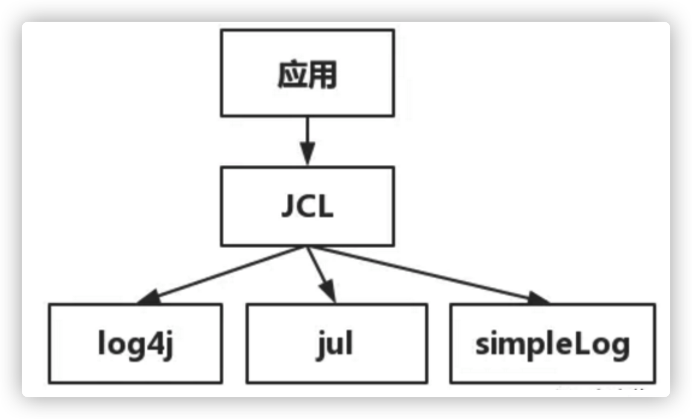

  

JCL默认配置：如果能找到Log4j 则默认使用log4j 实现，如果没有则使用jul(jdk自带的) 实现，再没有则使用jcl内部提供的SimpleLog 实现。

于是，代码里变成这么写了：

```java
import org.apache.commons.logging.Log;
import org.apache.commons.logging.LogFactory;

// 省略
Log log = LogFactory.getLog(Test.class);
log.trace('trace');
// 省略
```

至于这个Log具体的实现类，JCL会在ClassLoader中进行查找。这么做有三个缺点，缺点一是效率较低，二是容易引发混乱，三是在使用了自定义ClassLoader的程序中，使用JCL会引发内存泄露。

于是log4j的作者觉得JCL不好用，自己又写了一个新的接口api，那么就是slf4j。关于slf4j的集成图如下所示

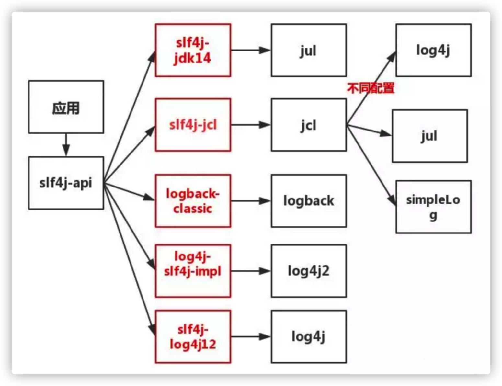

如图所示，应用调了sl4j-api，即日志门面接口。日志门面接口本身通常并没有实际的日志输出能力，它底层还是需要去调用具体的日志框架API的，也就是实际上它需要跟具体的日志框架结合使用。由于具体日志框架比较多，而且互相也大都不兼容，日志门面接口要想实现与任意日志框架结合可能需要对应的桥接器，上图红框中的组件即是对应的各种桥接器！

我们在代码中需要写日志，变成下面这么写：

```java
import org.slf4j.Logger;
import org.slf4j.LoggerFactory;

// 省略
Logger logger = LoggerFactory.getLogger(Test.class);
// 省略
logger.info("info");
```

在代码中，并不会出现具体日志框架的api。程序根据classpath中的桥接器类型，和日志框架类型，判断出`logger.info` 应该以什么框架输出！注意了，如果classpath中不小心引了两个桥接器，那会直接报错的！

因此，在阿里的开发手册上才有这么一条

**强制：应用中不可直接使用日志系统（log4j、logback）中的 API ，而应依赖使用日志框架 SLF4J 中的 API 。使用门面模式的日志框架，有利于维护和各个类的日志处理方式的统一。**

###### 如果要将jcl或jul 转slf4j呢？

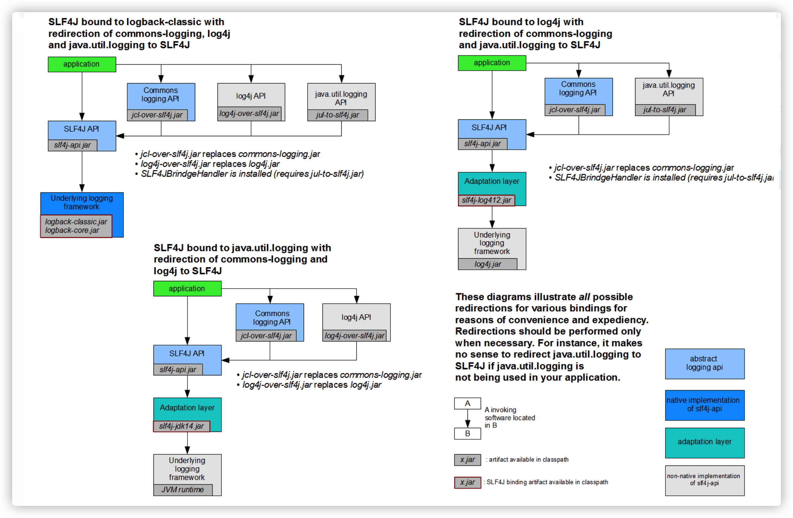


## 2. 日志实战

### 2.1 案例一

**一个项目，一个模块用log4j，另一个模块用slf4j+log4j2,如何统一输出？**

其实在某些中小型公司，这种情况很常见。日志文件里头既有log4j.properties，又有log4j2.xml。

那么如何统一输出！这里就要用上slf4j的适配器，slf4j提供了各种各样的适配器，用来将某种日志框架委托给slf4j。其最明显的集成工作方式有如下：

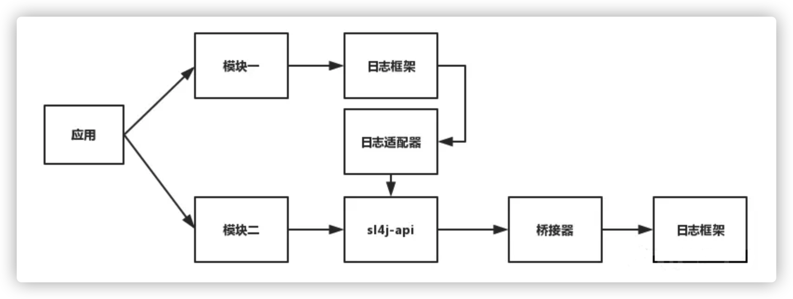

进行选择填空，将我们的案例里的条件填入,根据题意应该选log4j-over-slf4j适配器，于是就变成下面这张图

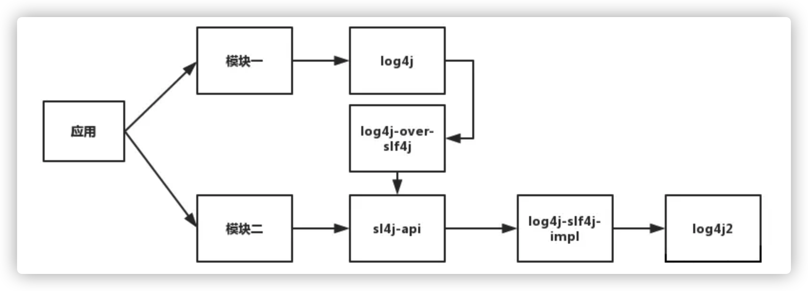

就可以实现日志统一为log4j2来输出！

> **注意**
>
> 根据适配器工作原理的不同，被适配的日志框架并不是一定要删除！以上图为例，log4j这个日志框架删不删都可以，只要能保证log4j的加载顺序在log4j-over-slf4j后即可。因为log4j-over-slf4j这个适配器的工作原理是，内部提供了和log4j一模一样的api接口，因此你在程序中调用log4j的api的时候，你必须想办法让其走适配器的api。如果你删了log4j这个框架，那你程序里肯定是走log4j-over-slf4j这个组件里的api。如果不删log4j，只要保证其在classpth里的顺序比log4j前即可！

### 2.1 案例二

**如何让spring以log4j2的形式输出？**

spring默认使用的是JCL输出日志，由于你此时并没有引入Log4j的日志框架，JCL会以JUL做为日志框架。此时集成图如下

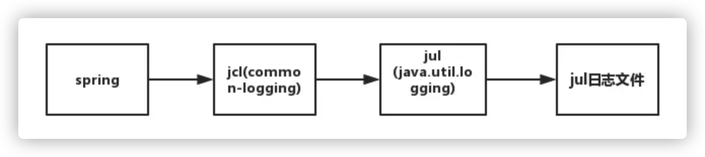

而你的应用中，采用了slf4j+log4j-core，即log4j2进行日志记录，那么此时集成图如下

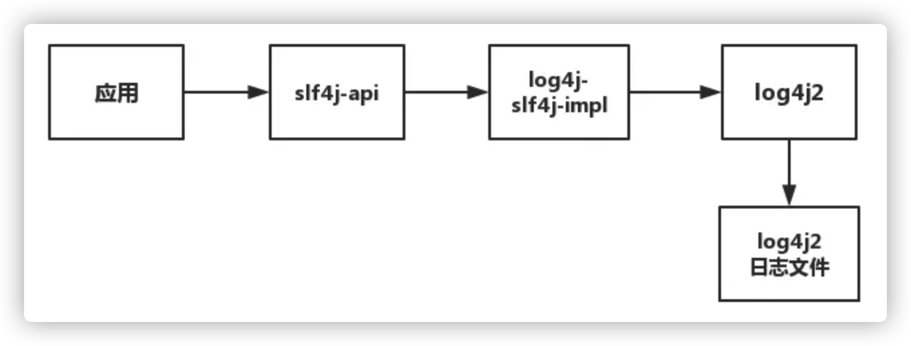

那我们现在需要让spring以log4j2的形式输出？怎么办？第一种方案，走jcl-over-slf4j适配器，此时集成图就变成下面这样了

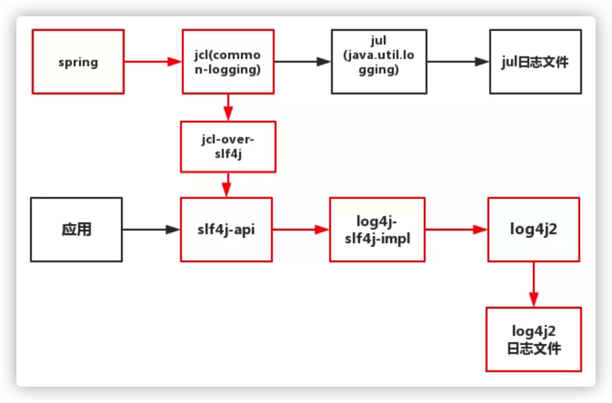

在这种方案下，spring框架中遇到日志输出的语句，就会如上图红线流程一样，最终以log4J2的形式输出！有第二种方案么？

有，走jul-to-slf4j适配器，此时集成图如下

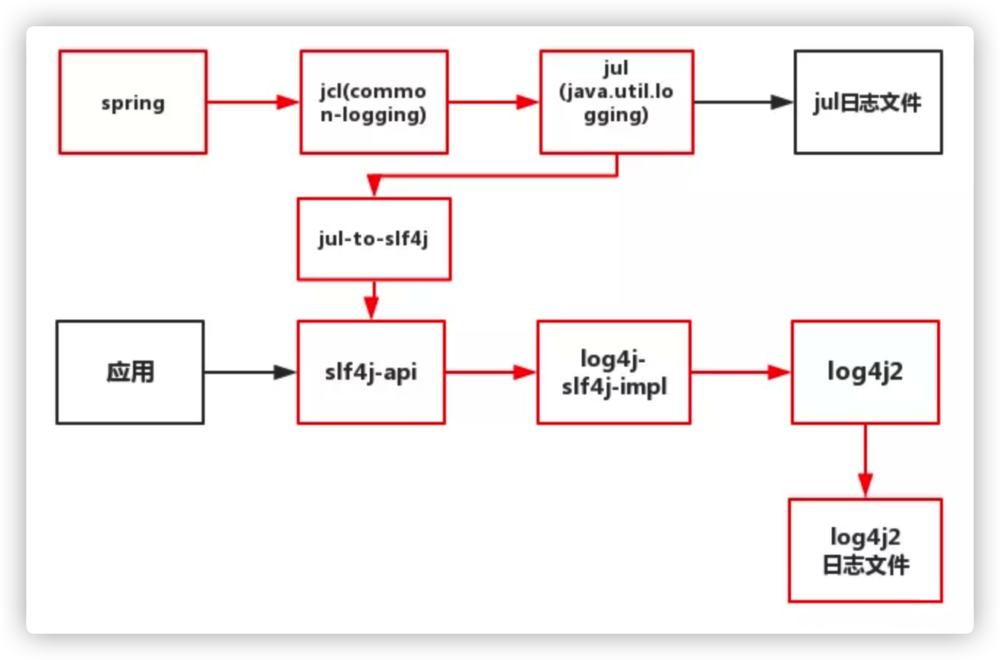

> **注意**
>
> 这种情况下，记得在代码中执行，这样jul-to-slf4j适配器才能正常工作，详情可以查询该适配器工作原理。
>
> ```java
> SLF4JBridgeHandler.removeHandlersForRootLogger();
> SLF4JBridgeHandler.install();
> ```

假设，我们在应用中调用了sl4j-api，但是引了四个jar包，slf4j-api-xx.jar，slf4j-log4j12-xx.jar，log4j-xx.jar，log4j-over-slf4j-xx.jar，就会出现如下尴尬的场面

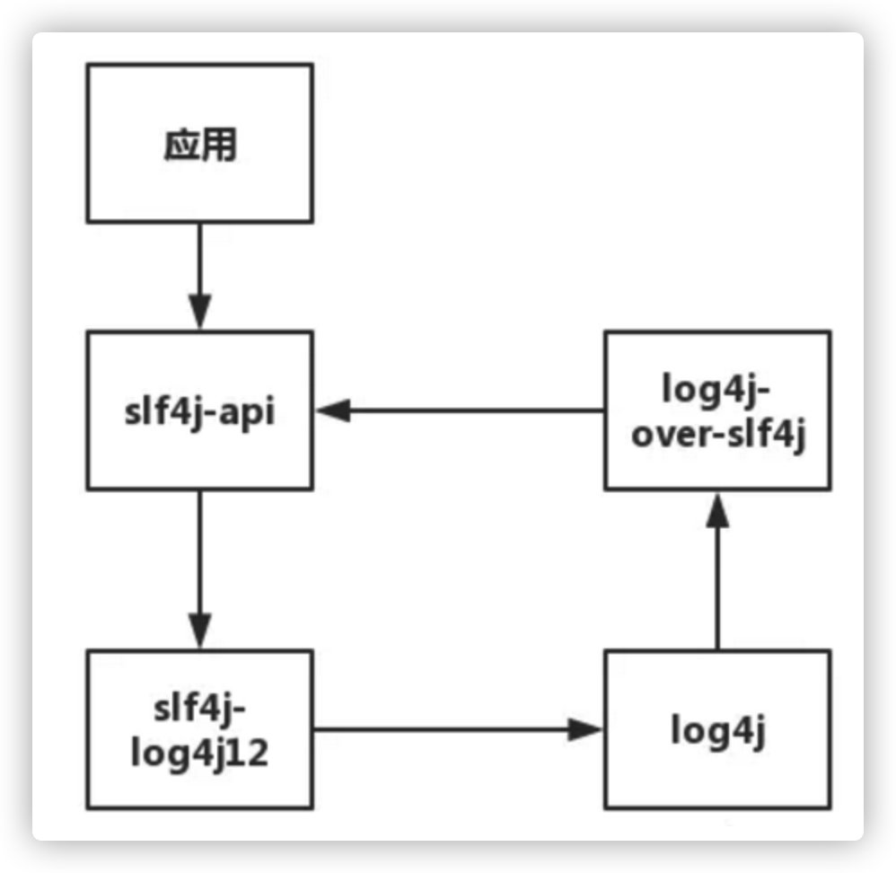

如上图所示，在这种情况下，调用了slf4j-api就会陷入死循环中！slf4j-api去调了slf4j-log4j12,slf4j-log4j12又去调用了log4j，log4j去调用了log4j-over-slf4j。最终，log4j-over-slf4j又调了slf4j-api，陷入死循环！


## 3. Spring4和Spring5日志中的不同

### 3.1 Spring4日志体系

构建spring4项目，采用java+注解的方式快速构建，pom中只引入spring-context包

```xml
<dependencies>
	<dependency>
		<groupId>org.springframework</groupId>
		<artifactId>spring-context</artifactId>
		<version>4.3.14.RELEASE</version>
	</dependency>
</dependencies>
```

运行下面的代码

```java
public static void main(String[] arg) {
	AnnotationConfigApplicationContext annotationConfigApplicationContext =
			new AnnotationConfigApplicationContext(AppConfig.class)
}
```

可以看到有日志输出

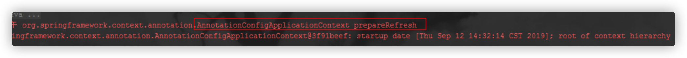

找到打印日志的地方，debug模式下，查看输出日志的Log是什么log

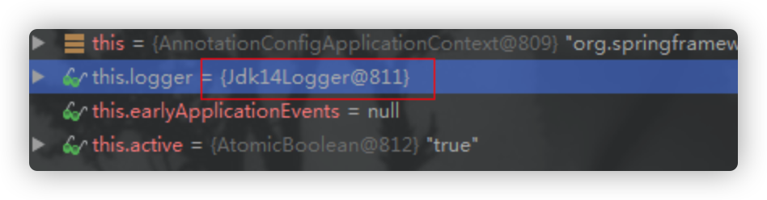

可以看出是jdk14Logger，这个之前说过是JUL，也就是说在默认spring日志体系下，采用的是JUL，接下来，我们按照之前的方法引入log4j，debug运行上面的程序，再次查看日志类型

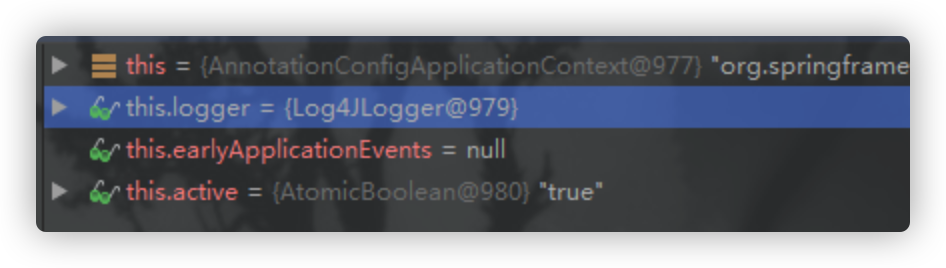

这次在增加log4j jar包和配置文件的情况下，spring4使用了log4j，这么JCL呢，让我们中打开spring4的日志依赖结构：

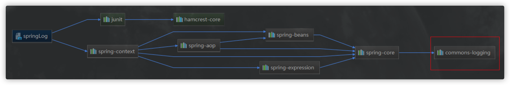

common-logging 就是JCL使用到的包，可以看出，Spring4使用的是原生的JCL，所以在有log4j的时候使用log4j打印日志，没有的时候使用JUL打印日志。

### 3.2 Spring5日志体系

线上依赖结构图：

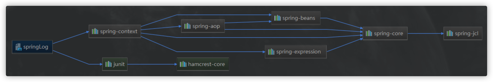

答题结构没变，只是原来common-logging ，换成了spring-jcl，看名字就知道是spring自造的包，JUL更是标注了，它使用的是JCL日志体系。

按照之前的经验，只用debug找到spring内部一个Log，看看他的产生方式和类型。这次看看AbstractApplicationContext里面找到产生Log的地方

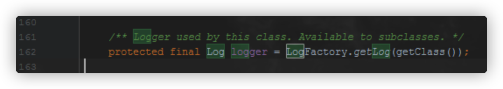

进入这个方法的 `getLog()` 中，找到LogAdapter中的 `createLog()` 方法

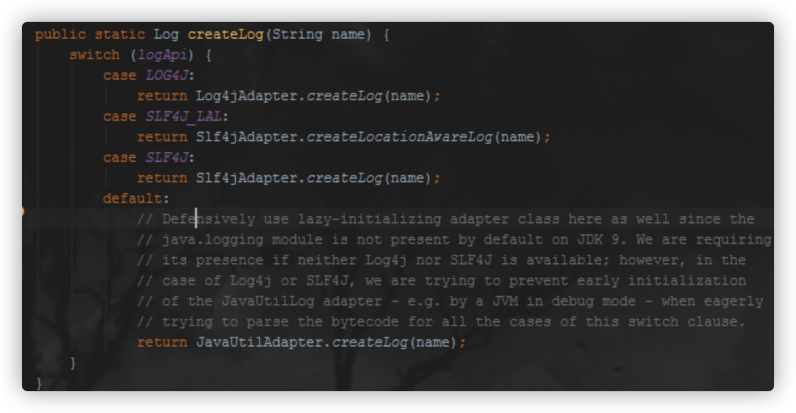

可以看出来spring5中对日志的生产，不在像原生JCL中那样使用一个数组，然后进行循环产生，这里用到的是`switch case`，这个关键字段LogApi又是在哪一部分赋值的呢？看图

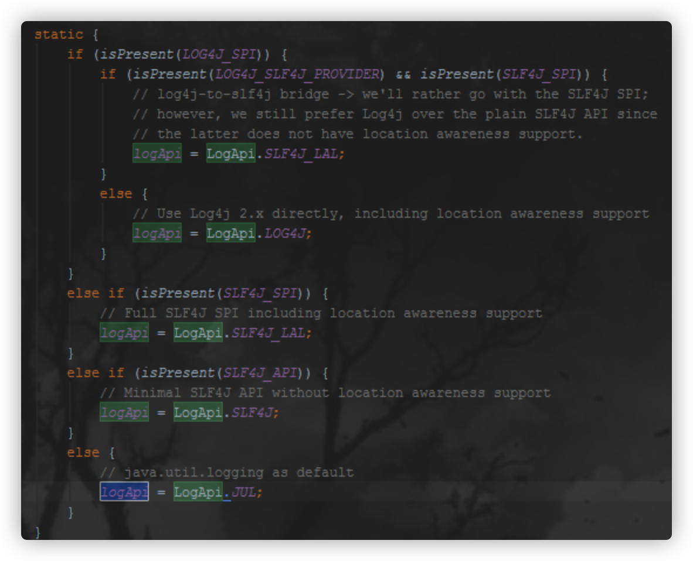

没错，是在静态代码块中赋的值，为了验证，我们准备用其中提到的log4j2验证（注意：log4j不行，因为这里的switch没有log4j选项），首先准备log4j2的配置文件

```xml
<Configuration status="WARN">
  <Appenders>
    <Console name="Console" target="SYSTEM_OUT">
    	<PatternLayout pattern="%d{HH:mm:ss.SSS} [%t] %-5level %logger{36} - %msg%n"/>
    </Console>
  </Appenders>
  <Loggers>
    <Root level="debug">
    	<AppenderRef ref="Console"/>
    </Root>
  </Loggers>
</Configuration>
```

然后准备pom

```xml
<dependencies>
	<dependency>
		<groupId>org.springframework</groupId>
		<artifactId>spring-context</artifactId>
		<version>5.1.9.RELEASE</version>
	</dependency>
	<dependency>
		<groupId>org.apache.logging.log4j</groupId>
		<artifactId>log4j-core</artifactId>
		<version>2.6.2</version>
	</dependency>
</dependencies>
```

代码还是这一行，直接运行：

```java
public class Test {
  public static void main(String[] arg) {
    AnnotationConfigApplicationContext annotationConfigApplicationContext =
        new AnnotationConfigApplicationContext(AppConfig.class)
  }
}
```

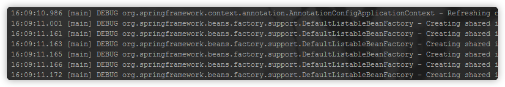

所以，在spring5中，依然使用的是JCL，但是不是原生的，是经过改造的JCL，默认使用的是JUL，而原生JCL中默认使用的是log4j。