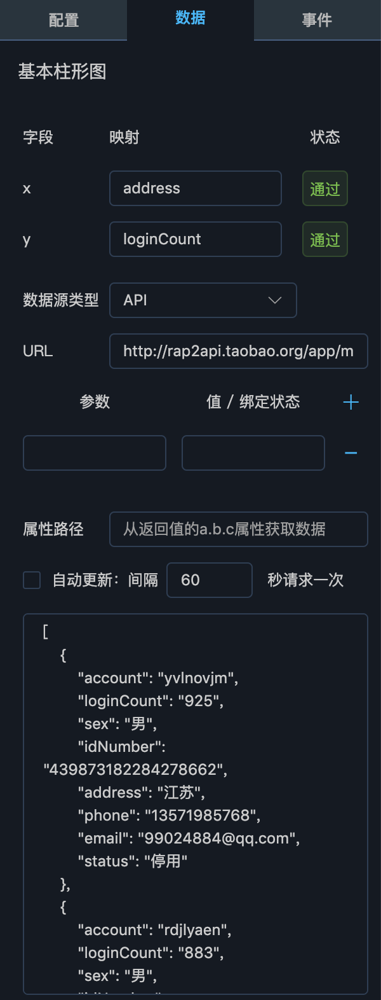

### 数据配置

如下图所示，数据面板对组件的数据来源进行配置，用户可以选择API、数据库、Excel文件、静态数据等数据源类型，然后根据不同的数据源类型分别进行配置。

图中所示为API类型，则填写URL，表示组件从此URL获取数据，同时还可配置查询参数、属性路径、以及是否定期重新发送请求更新数据。通过该配置获得的数据会实时显示在面板最下部的数据区域，通常为一个JSON数组或对象。

对数据源配置完成后，回到面板上半部，可以看到列出了该组件展示所需要的属性，图中为柱形图，需要`x`、`y`维度的数据，用户可以将底部数据区域显示的属性名填入映射栏，使数据在组件中展示出来。

图中填写的为`address`和`loginCount`属性，表示将数据的`address`属性映射为`x`轴，`loginCount`属性映射为`y`轴。

#### 绑定状态

绑定状态表示将组件的某个属性与全局变量进行绑定，绑定后，当全局变量发生变更时，此组件会根据新的变量值重新加载，从而实现组件的联动。

##### API参数绑定

在配置API数据源的查询参数时，可以将参数关联到全局状态上，填写参数字段后，在【值/绑定状态】列输入英文冒号`:`，会出现下拉选项，列出所有全局状态，可以通过选择或输入全局状态名称，使参数与全局状态进行数据关联，如下图所示：

进行数据关联后，当某个全局状态发生变更时，与其关联的组件会根据新的状态值重新发送数据查询请求，从而更新数据。

##### 数据库参数绑定

在数据面板选择数据源类型为数据库后，可通过数据库下拉框选择用户在数据源管理功能中配置的数据库，如下图所示：

选择数据库后，在SQL输入框中，可以输入SQL查询语句，对该数据库进行查询，从而获得组件需要的数据。在SQL语句中加入`:全局状态`，平台会在执行SQL之前，将所有冒号开头的字符串替换为全局状态值。需要注意的是，替换时不会区分字符串或数字，也就是说，如果需要在SQL中传入字符串，需写作` id=':id'`，而不是`id=:id`。当SQL中出现了全局状态，则当状态值发生变更时，组件会更具最新的值，向数据库查询数据，从而更新自身展示内容。
