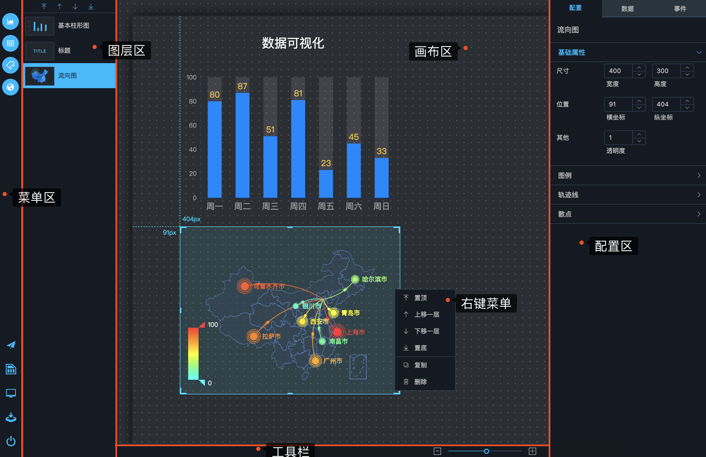

## 可视化定制

可视化定制界面分为菜单区、图层区、画布区、配置区、工具栏5大区域

- 菜单区：上半部分为各类组件选择菜单，包括图表、表格、插件、地图4个分类，每个分类中有若干组件，点击菜单项即可在画布上增加相应组件。下半部分是对可视化成果的操作，包括发布、保存、预览、下载、退出功能。发布功能可为可视化成果提供一个URL地址，通过浏览器访问这个地址，即可看到这个可视化成果，与图3-2展示的预览效果类似。

- 图层区：列出所有画布上的组件，选中组件后，点击图层区顶部的按钮，可以调整组件顺序，组件顺序越靠上，在地图上的层级越高，如果两个组件在画布上重叠，层极高的组件会覆盖层极低的组件。

- 画布区：画布区上对所有组件及其配置参数进行可视化，实现所见即所得的效果。画布上的组件可进行拖拽，拖拽时，组件左上角的标尺线会实时展示组件的上边距和左边距，实现精准定位。用户在选中组件后，可以看到组件边框的4个角和4条边中央位置有加粗线条，通过鼠标点击这些区域并拖拽，可以调整组件的大小。另外，选中组件后，右键点击该组件，可以弹出菜单，对组件的层级进行操作，并且可复制或删除组件。

- 配置区：当未选中任一组件时，配置区显示整个可视化的全局配置，可配置包括可视化的名称、封面，以及画布大小、背景图片、缩放方式等配置参数。当选中任意组件时，配置区显示该组件的配置项，后续章节会详细阐述组件的配置。

- 工具栏：主要负责对画布进行整体缩放。