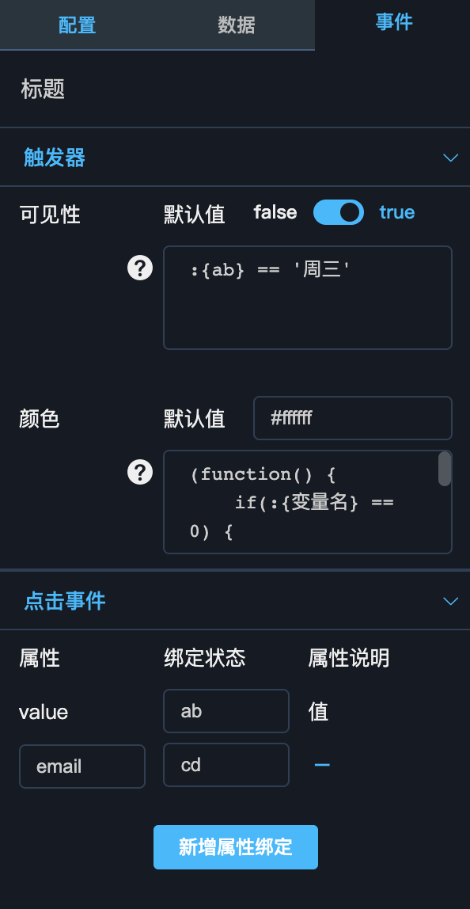

### 事件配置

事件配置面板包含触发器配置和事件配置两部分。




#### 触发器

触发器表示将组件自身的状态与内部数据或全局变量进行绑定，当数据发生变更时，触发器种定义的脚本会重新进行计算，并将计算的结果赋予组件的相应状态，从而触发组件自身的状态变化；

##### 变量占位符

- 全局变量

全局变量的占位符为`:{变量名}`，**与数据面板的变量占位符`:变量名`不同**，请注意区分。例如：

```
:{ab}
:{cd}
```


- 内部变量

引用组件内部变量的占位符为 `@{变量名}`，组件内部变量是从数据源返回的结果集中取数，由于数据集可能为对象或数组，所以占位符有2种格式。

数据为数组时，使用`@{[索引].属性}`的格式取值，例如：
```json
[
    {"attr": 5}, 
    {"attr": 6}
]
```
`@{[1].attr}` 表示取第2个元素的`attr`属性值6


数据为对象时，使用`@{属性.字属性}`的格式取值，例如：
```json
{
  "city": [
    {"name": "Beijing", "code":  1},
    {"name": "Xian", "code":  2}
  ]
}
```
`@{city[0].code}` 表示取`city`数组中第1个元素的`code`的值`1`

**以上两种模式可以混合使用，例如：`@{[0].parent[1].children}`**


##### 触发器配置

图中配置了两种触发器，**有限结果触发器**和**无限结果触发器**

- 有限结果触发器

有限结果触发器的返回结果是有限的，常见的为`true`和`false`。这类触发器只可以写判断条件，**不支持`===`符号**

```
:{ab} == :{cd} && (:{ab} == '周三' || :{cd} == 23)
```

- 无限结果触发器

无限结果触发器的返回结果是无限的，可以返回任意合法的结果。这类触发器需要写完整的函数执行脚本，例如：
    
```
(function() {
    if(@{[0].code} == 1) {
        return '#ff0000'
    } else {
        return '#ffffff'
    }
})()
```


#### 事件

事件表示组件可将自身的数据向外传递给全局变量，从而触发与该全局变量绑定的组件（在[数据配置](./Data-Panel.md)或[触发器](#触发器)中绑定）发生变更；

例如，图中的标题组件点击时，对外将自身数据中的`value`值和`email`值分别传递给全局变量`ab`和`cd`。


