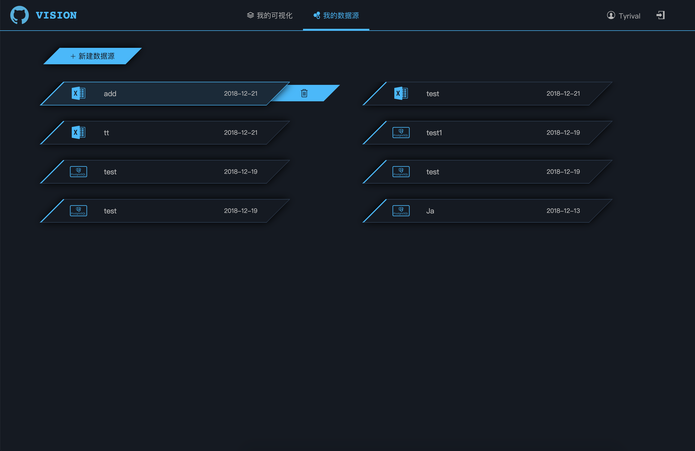

# 第3章 基本功能

### 我的可视化

列出了当前用户的可视化成果，并提供了基本的新增、编辑、删除、导出、预览、发布功能，点击“新增可视化”区域，或某个可视化的编辑按钮，可以跳转到 [可视化定制](./Design.md) 页面，对全新或已有的可视化成果进行定制。

点击“预览”按钮会弹出新窗口，对已有成果进行显示。

### 数据源管理

数据源管理功能页列出了所有当前用户维护的数据源，数据源类型包括数据库和excel文件，二者可通过图标进行直观区分，并可对数据源进行增删改操作，其中excel文件不可编辑，只可删除和重新上传。

