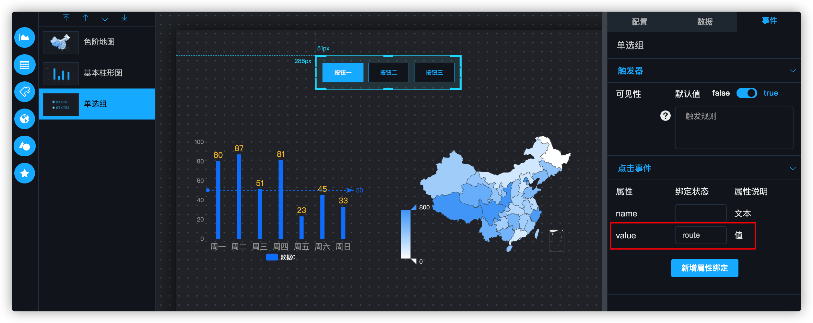
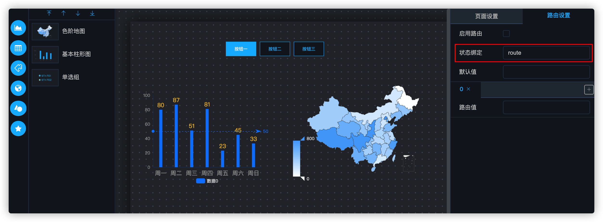
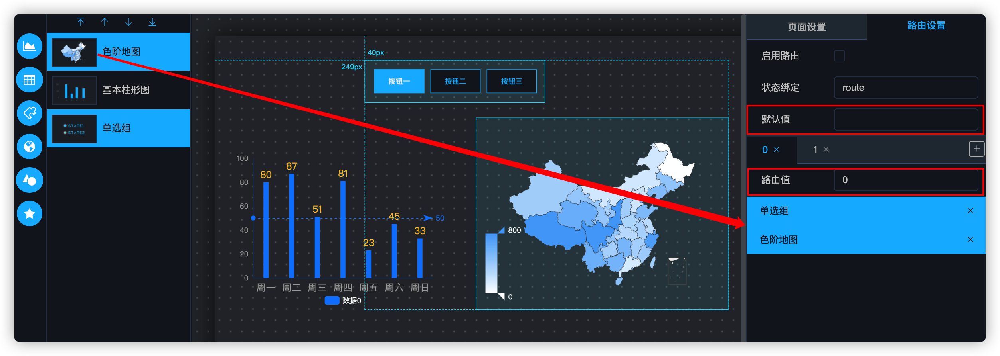
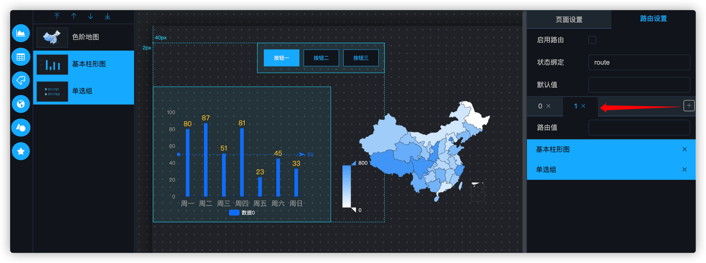
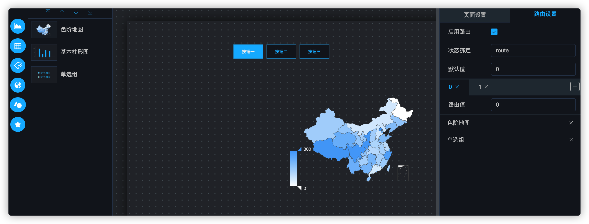
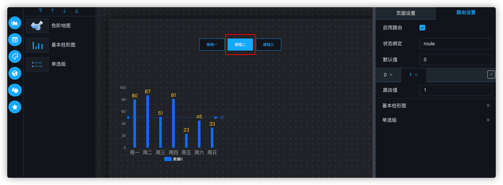

## 路由配置

路由主要是用于配置组件的批量显示/隐藏的功能，这种显示/隐藏的**优先级高于组件本身的可见性触发器**。

#### 1. 状态绑定

在可视化定制界面，选择一个单选组组件作为路由菜单，来控制整个页面的路由变化，将此组件的事件中的value属性与全局状态 `route` 进行绑定，然后通过 `route` 值的变化来控制整个页面的路由。此属性可按照用户的需要自由定制。

将右侧的配置面板切换到路由设置页，并将路由的值与全局状态中的 `route` 属性进行绑定。

> **注意**
>
> **不要勾选“启用路由”**，当路由未配置时，如果启用路由，默认会路由到第一个路由项，而此时没有组件关联到第一个路由项，所以全部组件都会被隐藏掉。

#### 2. 组件绑定

从左侧的Layer列表中，将**组件的图标**拖动到路由面板下半部分，可以建立组件与路由项的关联关系。可以一次拖动一个组件，也可以按住ctrl（MacOS上为⌘），多选组件后一次拖动多个，并且可以定义组件的路由值和默认值。表示当全局状态 `route` 值变为 `0` 时，路由到第一个路由项，默认值表示页面第一次加载时的路由项。

> **注意**
>
> **图中的单选组组件是用于控制整个页面路由状态的顶级组件，所以该组件需要拖动到每一个路由项中。**

点击路由TAB页旁边的+按钮可以增加路由项，然后再次将左侧的组件与路由项进行绑定。

> **注意**
>
> 点击TAB上的×可以删除路由项，删除会导致该路由项与组件的绑定关系失效，**此操作不可逆**。如果出现误删，需要新增加路由项并重新配置绑定关系。

#### 3. 启用路由

点击启用路由，可以看到页面已经开始路由，此时单选组组件传递出的值为 `0`，所以全局状态 `route` 的值为 `0`，也就会触发第一个路由项，此时基本柱形图不在该路由项内，所以就会被隐藏。

点击单选组的第二个选项，会将全局状态 `route` 的值修改为 `1`，就会触发第二个路由项，因为第二个路由项的路由值为 `1`。此时色阶地图不在该路由项内，被隐藏。

