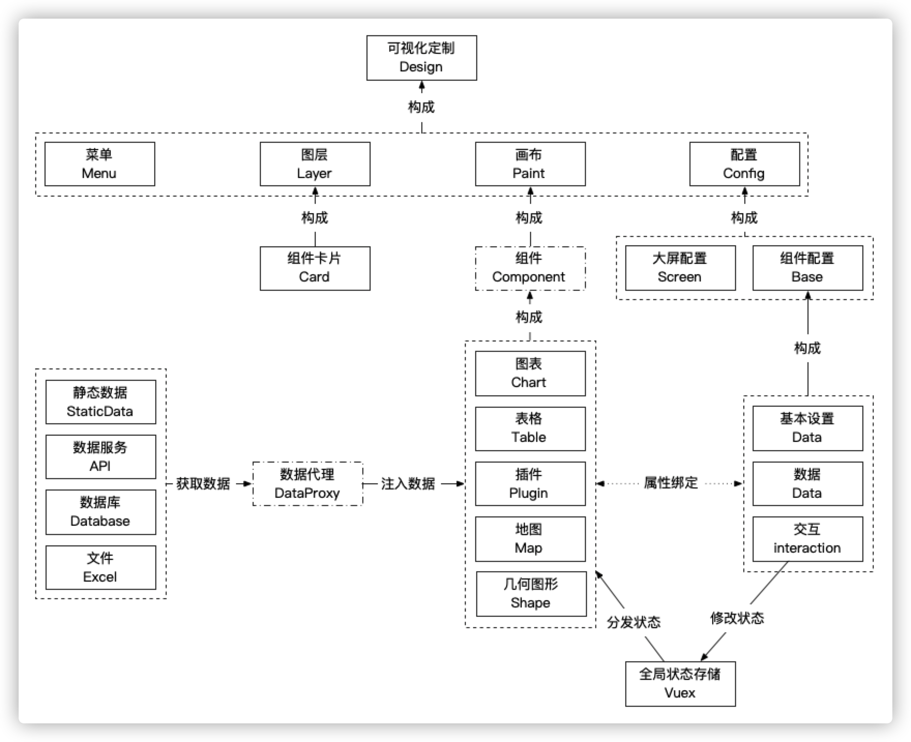
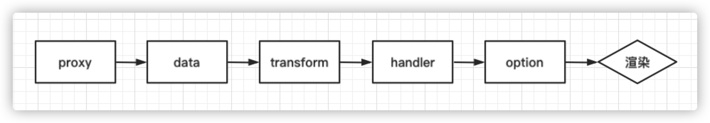
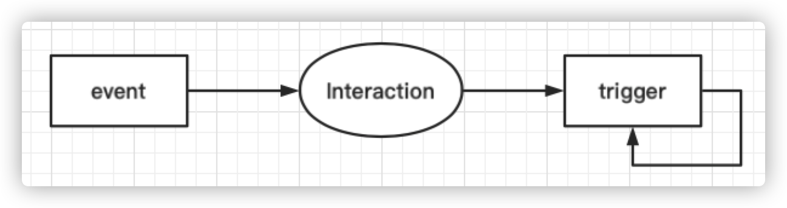
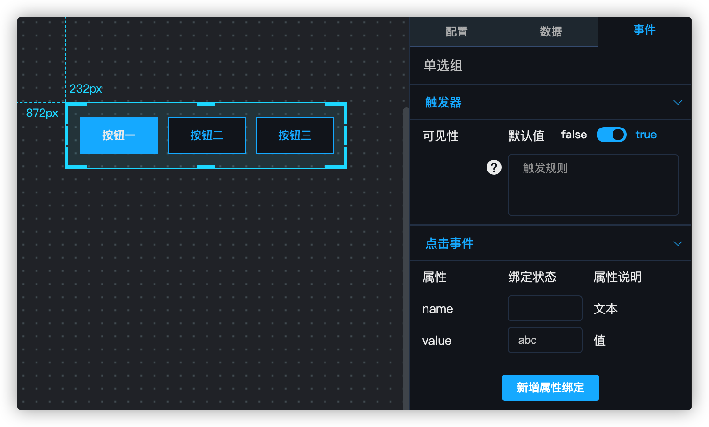
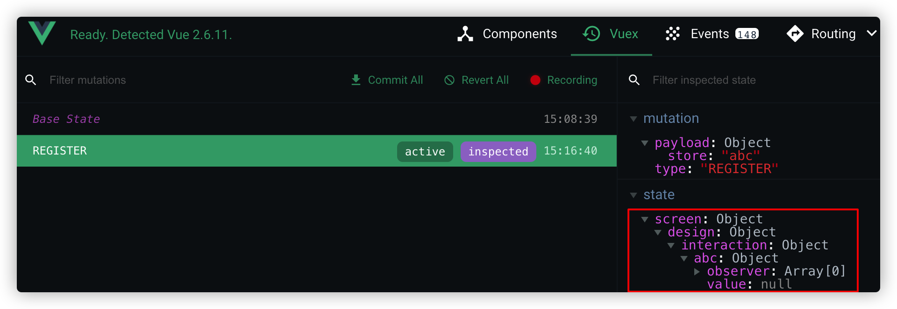
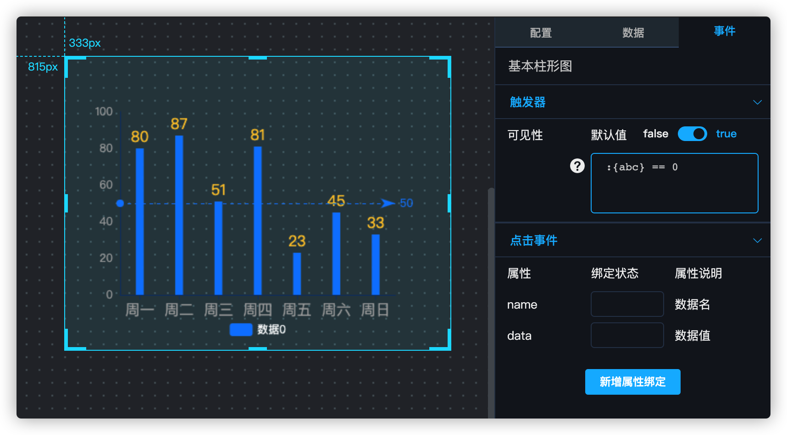
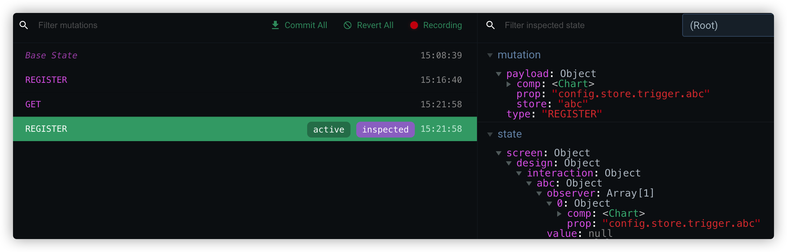
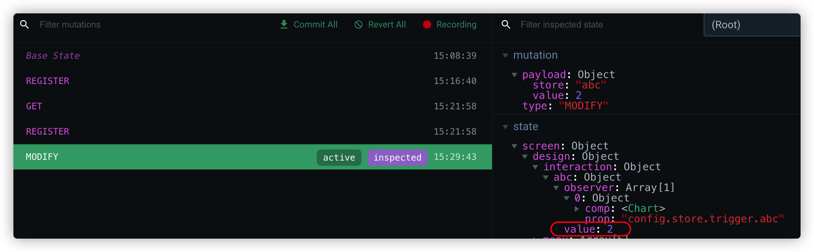
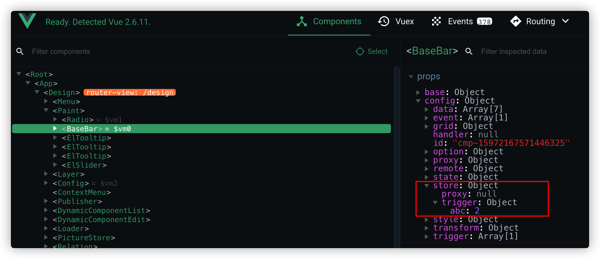

# 平台开发

## 1. 组件关系




## 2. 组件配置

所有组件的基本配置文件如下

```json
config: {
    // 基本样式
    style: {}, 
    // 组件的功能配置
    option: {},
    // 数据源配置
    proxy: {},
    // 默认数据
    data: [],
    // 数据映射规则
    transform: {},
  	// 数据转换逻辑
  	handler: function, 
    // 事件，当操作组件时，可对外传值
    event: [],
    // 触发器，当外部变量或内部数据变更时，触发对自身属性的修改
    trigger: [],
}
```

### 2.1 样式

##### style

组件的基本样式，通常是与组件的css相关的内容。

### 2.2 数据流



##### option

组件本身功能相关的配置项，例如echarts的option配置。

##### proxy

数据源配置，支持静态数据、API、数据库、Excel，通常配置 `type: 1` 作为静态数据源即可。当用户在数据源配置面板上进行修改后，数据代理会自动根据最新的数据源配置，重新获取数据。

##### data

默认数据集，组件初始化使用的数据集。数据代理根据proxy获取到数据后，也会存储在data中。

##### transform

数据映射规则和转换逻辑，由于组件是根据option进行渲染的，而data中获取的数据是无法直接载入option中的，所以要通过transform声明抽取data中的哪些属性，作为组件需要的数据维度。

##### handler

数据转换逻辑，根据transform声明的映射规则，将数据从data提取出来，然后转换并载入option中。

> **注意**
>
> 由于handler执行完毕后，得到的就是组件渲染的最终option，所以handler可以看作组件渲染前的最后一步。于是，我们可以在handler里面对option进行任意的修改，以满足一些个性化的需求。例如：根据数据的值，调整饼图各扇形的渐变色。

### 2.3 联动机制



##### event

事件，用户对组件操作时，对外传值的规则。

##### trigger

触发器，当外部或内部变量发生变化时，对组件内部的属性进行修改，从而对组件的样式、配置等进行修改。触发器脚本中的变量包含**内部变量**和**外部变量**。

- 内部变量

占位符为 `@{变量}`，表示从组件的data属性中取值的规则。例如：

```js
data: [
		{name: "Tom", value: 0},
		{name: "Jerry", value: 1}
]
// 占位符为 @{[0].name} 表示指向data中第1个元素的name属性，即"Tom"

data: {
		success: true,
		list: [
				{name: "Tom", value: 0},
				{name: "Jerry", value: 1}
		]
}
// 占位符为 @{list.[1].value} 表示指向list属性中，第2个元素的value属性，即1
```

- 外部变量

占位符为 `:{变量}`，表示从interaction中对应的属性取值。从联动的流程图中可以看出，实际上值是由interaction向组件中推送的，而不是由组件到interaction中主动抓取。

> **注意**
>
> trigger中声明外部变量后，会被组件提取出来，一方面注册到公共变量池interaction中，另一方面储存到组件的一个内置属性 `store.trigger` 中。当interaction中的次变量发生变更时，会将修改后的值注入该组件的 `store.trigger.变量` 。
>
> 组件内部有一个专门监听 `store.trigger` 的watch，当 `store.trigger` 中的属性值发生变更时，会根据最新的值执行trigger中的脚本，并将返回值注入组件的相应属性，从而实现对组件的修改。

##### interaction

公共变量池，储存在 `Vuex.state.screen.design.interaction` 中，基本数据结构如下：

```json
interaction: {
		变量A: {
				value: 变量值
				observer: [{
						cmp: 组件对象,
						prop: 组件的属性路径
				}]
		},
		变量B: { ... }
}
```

#### 示例

1. 当用户在组件的事件（event）面板中声明变量时，组件会自动将此变量注册到interaction中。例如，组件Radio的点击事件中声明了变量 `abc`，表示当按钮被点击时，会对外传递该按钮对应数据的value属性的值。



变量就会被添加到interaction中，数据结构如下：

```json
interaction: {
		abc: {
				value: null,
				observer: []
		}
}
```

> **Vue Devtools**
>
> Chrome安装Vue Devtools之后，可以查看相关的数据结构。



2. 当用户在组件的触发器（trigger）面板中声明触发规则后，组件会将规则脚本中的变量解析出来，将其中的**外部变量**注册到interaction中。例如，组件BaseBar的可见性触发器的规则脚本如下：

```js
:{abc} == 0
```



此时 `abc` 属性会被注册到interaction，如果interaction中没有 `abc` 属性（即没有任何组件的event中声明了 `abc` 属性），也会注册为如下结构：

```json
interaction: {
		abc: {
				value: null
				observer: [{
						comp: <Chart>,
						prop: "config.store.trigger.abc"
				}]
		}
}
```



可以看到，observer数组中多了一个元素，表示BaseBar这个组件订阅了 `abc` 这个变量，并且是BaseBar的 `config.store.trigger.abc` 这个属性进行了订阅。

3. 至此，整个联动规则配置完毕。当Radio中的选项被点击时，相应的值（假设值为2）会传递给 `interaction.abc.value`，可以看到 `abc.value` 值被修改为2。



同时，可以看到Vuex中增加了一条MODIFY记录，MODIFY中，除了对value进行赋值，还会对 `abc.observer` 进行遍历，将值注入BaseBar的 `config.store.trigger.abc` 属性中。



4. 最后，BaseBar中监听 `config.store` 的watch会重新计算：

```js
// 将上面脚本中的 :{abc} 替换为2后，脚本如下。
2 == 0
```

脚本执行后返回的结果为 `false`，会被赋值给BaseBar的对应属性。


## 3. 组件开发

以基本柱状图BaseBar为例，介绍一般组件的开发规范。组件开发主要是在 `src/components/screen/` 下的 `config` 和 `layer` 文件夹，layer中是组件的在画布上的样式和功能，config中是组件在可视化定制页面右侧的配置面板。

### 3.1 layer

`src/components/screen/layer/chart/BaseBar.vue` 文件的主要结构如下：

```vue
<template>
    <Chart :config="config" :base="base"></Chart>
</template>

<script>
    import Chart from '@/components/screen/layer/base/Chart'
    import _ from 'lodash'

    export default {
        name: 'BaseBar',
        props: ['config', 'base'],
        data() {
            return {}
        },
        methods: {
          	/**
             * 用于储存组件的配置项，所有需要绑定的属性都需要显式声明，否则会造成config中的配置面板组件加
             * 载报错。
             */
            initOption() {
                let defaultOption = {
                  ......
                }
                this.config.option = _.assignIn(defaultOption, this.config.option)
            },
          	/**
             * 组件初始化时的默认数据data配置
             */
            initData() {
                this.config.data = this.config.data || [
                    {name: '周一', series0: 80, series1: 60},
                    {name: '周二', series0: 87, series1: 80}
                ]
            },
          	/**
             * 事件配置，会被自动转换为事件面板上的配置项。
             * 其中每个元素表示一个事件，当事件触发时，组件会根据配置，将组件的内部属性值向外传递给指定的全
             * 局变量，当其他组件与该全局变量进行了绑定，则会触发这些组件的变化，例如：组件的显示与隐藏，组
             * 件从远端接口重新获取数据。
             * 其中各属性的含义如下：
             * - name: Echarts的组件事件，
             *   详细参考：https://echarts.apache.org/zh/api.html#events
             * - comment: 事件中文说明，会出现在事件配置面板上
             * - binders: 事件触发时，向外传递数据的规则，其中各属性含义如下：
             *     - name: 当未声明 prop 属性时生效，表示对外传递数据对象的属性名，
             *       例如下面的第2条绑定规则,
             *       {name: 'series', comment: '数据名', state: null},
             *       表示柱图中某个柱子，或者饼图中某个扇形被点击，假设点击的是data中的第1个数据对象，即
             * 			 {name: '周二', series: 87}，此时对外传递的值为series属性对应的87
             *     - comment: 对外传值的中文说明，会显示在事件配置面板上
             *     - prop: 当 prop 声明时，则事件对外传值时，不再从 data 的数据对象中取值，并对外传递，
             *			 而是从Echarts的事件函数的参数params中取值，例如下面的第 3 条绑定规则，
             *       {name: 'data', comment: '参数对象', prop: 'data', state: null}
             *       表示对外传递属性params.data的值，params的具体说明参考上面Echarts鼠标事件在线文档
             *     - state: 当事件触发时，用来接收对外传值的全局变量属性名，这个全局变量名由
             *       用户进行配置，所以state的的值固定为 null
             */
            initEvent() {
                this.config.event = this.config.event || [{
                    name: 'click',
                    comment: '点击事件',
                    binders: [
                    		{name: 'name', comment: '数据名', prop: 'name', state: null},
                    		{name: 'data', comment: '数据值', prop: 'data', state: null},
                    ]
                }]
            },
          	/**
             * 数据代理，可以声明 type: 1，表示默认数据源为本地静态数据，
             */
            initProxy() {
                this.config.proxy = this.config.proxy || {
                    type: 1,
                }
            },
          	/**
             * 数据映射规则，这个规则会在数据配置面板上自动转换为配置界面，
             * 通常与data中的数据属性保持一致。
             */
            initTransform() {
                this.config.transform = this.config.transform || {
                    mapper: {
                        name: null,
                        series0: null
                    }
                }
            },
          	/**
             * 触发器，此处的配置会自动转化为事件面板上的触发器配置界面，其中各属性的含义如下：
             * - show: 表示此触发器是否在触发器配置界面显示，通常设置为true即可。
             * - name: 显示在触发器配置界面的说明。
             * - binder: 此处是由用户进行设置的触发器绑定规则，默认为null即可。
             * - prop: 当触发器相关的内/外部属性发生变更时，触发组件的哪个属性发生变更。
             * - defaultValue: 当用户未对该触发器进行设置时，默认选择mapper中哪个选项的key。
             * - isScript: 表示binder中的配置是作为javascript脚本，还是作为字符串。
             *		 => true: 表示binder的内容会作为脚本进行执行，执行结果赋予该组件的相应属性；
             * 		 => false: 表示binder的内容会作为字符串直接赋予该组件的相应属性；
             *	 	 例如Iframe组件的URL属性就是配置为false后，利用此机制进行实现。
             * - mapper: 表示binder计算得到的结果分别对应什么值，该值才是最终被赋予组件的相应属性的值，
             *   此属性主要用于规范值的范围，避免用户在 binder 中声明过于复杂的结果，或因拼写错误导致脚本
             *	 执行失败。其中各属性的含义如下：
             *      - key: binder计算出的结果；
             *      - value: binder计算结果对应的值，最终赋予组件的相应属性；
             *      - comment: 触发器面板上的说明文字。
             */
          	initTrigger() {
                this.config.trigger = this.config.trigger || [{
                    show: true,
                    name: '可见性',
                    binder: null,
                    prop: "config.style.visibility",
                    defaultValue: true,
                    isScript: true,
                    mapper: [
                        {key: true, value: 'visible', comment: '返回 true 时显示'},
                        {key: false, value: 'hidden', comment: '返回 false 时隐藏'},
                    ]
                }]
            },
            /**
             * handler函数的定义
             */
            handler() {
                let dimensions = []
                for (let key in this.config.transform.mapper) {
                    let dim = this.config.transform.mapper[key] || key
                    let data = this.config.data
                    if (!data || !data.length || !data[0].hasOwnProperty(dim)) {
                        dim = null
                    }
                    dimensions.push(dim)
                }
                this.config.option.dataset = {
                    dimensions: dimensions,
                    source: this.config.data
                }
            }
        },
        components: {
            'Chart': Chart
        },
    }
</script>
```

### 3.2 config

`src/components/screen/config/chart/BaseBar.vue` 文件的主要结构如下，主要是将组件的option中各属性绑定到配置面板上，使用户可以对组件进行定制。

```vue
<template>
    <el-collapse value="0" accordion>
        <!-- 基础属性 -->
        <el-collapse-item title="基础属性" name="0">
            <el-row>
                <el-col :span="8" class="tag">尺寸</el-col>
                <el-col :span="8">
                    <el-input-number v-model="component.config.style.width"
                                     size="mini"
                                     controls-position="right"
                                     :min="0">
                    </el-input-number>
                    <div class="description">宽度</div>
                </el-col>
                <el-col :span="8">
                    <el-input-number v-model="component.config.style.height"
                                     size="mini"
                                     controls-position="right"
                                     :min="0">
                    </el-input-number>
                    <div class="description">高度</div>
                </el-col>
            </el-row>
        </el-collapse-item>
      	......
    </el-collapse>
</template>

<script>
    export default {
        name: "BaseBar",
        props: ["component"],
    }
</script>
```

### 3.3 注册组件

组件开发完成后，需要添加到组件菜单 `category.js` 中，使用户可以选择，并且需要给组件增加缩略图。

##### category.js

`src/config/category.js` 中，基本结构如下：

```js
const Category = [{
    icon: 'chart',
    text: '图表',
    show: false,
    categories: [{
        text: '2D图表',
        icon: 'chart',
        items: [
          	/**
          	 * BaseBar被添加到此处，平台会根据此处的配置，从src/components/screen/layer/中加载组件，
          	 * category表示从chart文件夹中加载，name表示加载BaseBar.vue组件。
          	 */
            {text: '基本柱形图', category: 'chart', name: 'BaseBar'},
            {text: '堆叠柱图', category: 'chart', name: 'StackBar'},
            ...
        ]
    }, ...]
}, {
    icon: 'map',
    text: '地图',
    show: false,
    categories: [{
        text: '地图',
        icon: 'map',
        items: [
            ...
        ]
    }]
}, ...]

export default Category
```

##### 缩略图

缩略图储存在 `public/img/components/chart/BaseBar.png` 中，`chart` 和 `BaseBar` 这两个路径需要与category.js中注册的 `category` 和 `name` 属性保持一致。

