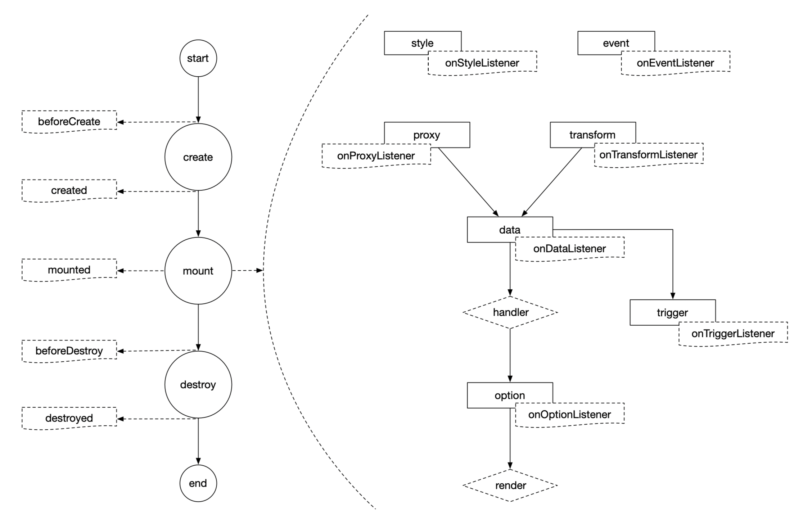

# 第4章 组件开发

## 组件

组件的逻辑如下图所示，左侧为组件的**生命周期**，右侧为组件渲染完成后的**活动逻辑**。




#### 生命周期

组件的生命周期分为 `create`、`mount`、`destroy` 三个阶段，共包含 `beforeCreate`、`created`、`mounted`、`beforeDestroy`、`destroyed` 共5个钩子函数，与vue组件的钩子函数一致。


#### 活动逻辑

由于组件采用了数据驱动的模式，而组件的数据主要存储在 `style`、`proxy`、`transform`、`data`、`option`、`trigger` 6个配置项中，当某个配置项中的数据发生变更时，会触发其他配置项的变化，主要的触发逻辑如图中箭头所示。

###### - `style`

样式数据，发生变更时，会触发钩子函数 `onStyleListener` 。

###### - `proxy`

数据源配置，发生变更时，会触发钩子函数`onProxyListener`，并重新从数据源获取数据，并存储到 `data` 中。

###### - `data`

默认的数据集，如果使用API、数据库等动态数据源时，从远端获取的真实数据会覆盖此处的默认数据。发生变更时，会触发 `config.handler` 函数，将数据进行转换映射，并存储到 `option` 中。

`option` 与 `data` 的区别在于， `data` 中的数据是面向 `proxy` 的，用于接收从数据源获取到的数据集；而 `option` 中的数据和配置项是面向组件模板 `template` 的，因为 `template` 中的数据绑定和属性引用必须显式声明。

###### - `transform`

数据映射规则，发生变更时，会触发钩子函数 `onTransformListener`。

###### - `option`

组件面向 `template` 的功能数据，发生变更时，触发钩子函数 `onOptionListener`，并调用 `config.render` 函数，`render` 函数主要用于渲染那些无法通过数据绑定来进行渲染的数据。例如：echarts的配置项发生变更时，是无法自动渲染到页面上的，必须调用 `echarts.setOption(this.config.option)` 来载入配置。

###### - `trigger`

触发器配置，发生变更时，触发钩子函数 `onTriggerListener`。

###### - `event`

事件配置，发生变更时，触发钩子函数 `onEventListener`。


## 开发规范

### 脚本示例

用户可以按照规范编写组件的开发脚本，并将其注册到系统中，即可对组件进行扩展，开发脚本示例如下：

   **注意：开发脚本中不允许包含任何注释**

```js
/**
 基本格式为:
 (function () {
    return {
    		// 字符串，vue格式的HTML模板，可包含vue的指令，数据绑定等操作，比如 v-if, :bind, @click 等。
        template: "",   
        config: {
        		// 对象，组件的基本样式，可为空。
            style: {}, 
            // 对象，组件本身的配置，必填。
            option: {},
            // 数组，组件载入的默认数据，必填。
            data: [],
            // 数组，组件的事件注册，可为空。
            event: [],
            // 对象，组件默认的数据源配置，可为空。
            proxy: {},
            // 对象，组件的数据映射规则，必填。
            transform: {},
            // 数组，组件使用的触发器，可为空。
            trigger: [],
            // 函数，将data数据转化为合适的格式，并赋值给option中的相应属性，必填。        
            handler: function(config){}
            // 函数，在option变更后执行，通常用于chart、map等组件用于执行setOption等渲染操作，可为空。
            render: function(config) {}
        }
    }
 })()
 */
(function () {
    return {
        template: `
            <button style="font-size:40px;"
                    @click="onEvent('click', config.data[0])">
                {{config.option.name}}
            </button>`,
        /**
         * 方法
         */
        methods: {},
        /**
         * 监听器
         */
        watch: {},
        /**
         * 组件配置
         */
        config: {
            /**
             * 组件样式
             */
            style: {
                // 宽度，默认值：400
                width: 400,
                // 高度，默认值：300
                height: 300,
                // 透明度，默认值：1
                opacity: 1,
                // 初始的可见性，'visible'/'hidden'，默认值：'visible'
                visibility: 'visible'
            },
            /**
             * 用于储存组件的配置项，以及template中绑定的数据，所有需要绑定的属性都需要显式声明
             */
            option: {
                data: {name: null}
            },
            /**
             * 组件初始化时的默认数据
             */
            data: [
                {name: '按钮一', value: 80}
            ],
            /**
             * 事件配置，会被自动转换为事件面板上的配置项。
             * 其中每个元素表示一个事件，当事件触发时，组件会根据配置，将组件的内部属性值向外传递
             * 给指定的全局变量，当其他组件与该全局变量进行了绑定，则会触发这些组件的变化，
             * 例如：组件的显示与隐藏，组件从远端接口重新获取数据。
             * 其中各属性的含义如下：
             * - name: Echarts的组件事件，详细参考：https://echarts.apache.org/zh/api.html#events
             * - comment: 事件中文说明，会出现在事件配置面板上
             * - binders: 事件触发时，向外传递数据的规则，其中各属性含义如下：
             *      - name: 当未声明 prop 属性时生效，表示对外传递数据对象的属性名，
             *							例如下面的第2条绑定规则,
             *              {name: 'series', comment: '数据名', state: null},
             *              表示柱图中某个柱子，或者饼图中某个扇形被点击，假设点击的是data中的
             *							第1个数据对象，即 {name: '周二', series: 87}，
             *              此时对外传递的值为series属性对应的87
             *      - comment: 对外传值的中文说明，会显示在事件配置面板上
             *      - prop: 当 prop 声明时，则事件对外传值时，不再从 data 的数据对象中取值，
             *							并对外传递，而是从Echarts的事件函数的参数params中取值，
             *							例如下面的第 3 条绑定规则，
             *              {name: 'data', comment: '参数对象', prop: 'data', state: null}
             *              表示对外传递属性params.data的值，params的具体说明参考上面
             *							Echarts鼠标事件在线文档
             *      - state: 当事件触发时，用来接收对外传值的全局变量属性名，这个全局变量名由
             *							用户进行配置，所以state的的值固定为 null
             */
            event: [{
                name: 'click',
                comment: '点击事件',
                binders: [
                    {name: 'name', comment: '数据名', prop: 'name', state: null},
                    {name: 'series', comment: '数据值', state: null},
                    {name: 'data', comment: '参数对象', prop: 'data', state: null},
                ]
            }],
            /**
             * 数据代理，可以不声明，或声明 type: 1，表示默认数据源为本地静态数据，
             * 即从上面的 data 属性获取数据。
             * 高级配置项可联系开发人员获取。
             */
            proxy: {
                type: 1,
            },
            /**
             * 数据映射规则，这个规则会在数据配置面板上自动转换为配置界面，
             * 通常与data中的数据属性保持一致。
             */
            transform: {
                mapper: {
                    name: null
                }
            },
            /**
             * 触发器，此处的配置会自动转化为事件面板上的触发器配置界面，其中各属性的含义如下：
             * - show: 表示此触发器是否在触发器配置界面显示，通常设置为true即可
             * - name: 显示在触发器配置界面的说明
             * - binder: 此处是由用户进行设置的触发器绑定规则，默认为null即可
             * - prop: 当触发器相关的内/外部属性发生变更时，触发组件的哪个属性发生变更
             * - defaultValue: 当用户未对该触发器进行设置时，prop指向属性的默认值
             * - isScript: 表示binder中的配置是作为javascript脚本，还是作为字符串。
             *						 	为true时，表示binder的内容会作为脚本进行执行，执行结果赋予该组件
             *					 	 	的相应属性;
             *           	 	为false时，表示binder的内容会作为字符串直接赋予该组件的相应属性，
             *					 	 	例如Iframe组件的URL属性就是利用此机制进行实现。
             * - mapper: 表示binder计算得到的结果分别对应什么值，该值才是最终被赋予组件的相应
             *						属性的值，此属性主要用于规范值的范围，避免用户在 binder 中声明过
             *						于复杂的结果，或因拼写错误导致脚本执行失败。其中各属性的含义如下：
             * 			- key: 	binder计算出的结果
             *      - value: binder计算结果对应的值，最终赋予组件的相应属性
             *      - comment: 触发器面板上的说明文字
             */
            trigger: [{
                show: true,
                name: '可见性',
                binder: null,
                prop: "config.style.visibility",
                defaultValue: true,
                isScript: true,
                mapper: [
                    {key: true, value: 'visible', comment: '返回 true 时显示'},
                    {key: false, value: 'hidden', comment: '返回 false 时隐藏'},
                ]
            }],
            /**
             * 组件的所有配置都加载完成后（包括从远端获取数据），在组件渲染之前，所做的最后一次操作，
             * 通常，远端获取的数据属性与transform的默认属性差距较大，需要根据transform.mapper
             * 中的映射规则，对数据进行转换处理，并赋予option中的相应属性，然后才可使组件成功渲染。
             * 高级用法：由于handler是在渲染之前执行，所以还可以对组件的其他属性进行适合的修改，从
             * 而实现更高级的功能。例如：可以根据远端获取的数据，计算饼图每个扇形的渐变色范围。
             * - config: 此组件的完整配置项，基本结构与此JS脚本的返回值一致。
             */
            handler: function (config) {
                let data = config.data[0]
                let mapper = config.transform.mapper
                let propValue = mapper.name || 'name'
                config.option.data.name = data[propValue]
            },
            /**
             * 组件渲染，当handler将数据转换到option中后，渲染组件的函数，
             * 例如：echarts.setOption(this.config.option)
             */
            render: function (config) {
                console.log("render")
            }
        },
        /**
         * 钩子函数
         */
        hooks: {
            beforeCreate: function (self) {
                console.log("beforeCreate")
            },
            created: function (self) {
                console.log("created")
            },
            mounted: function (self) {
                console.log("mounted")
            },
            beforeDestroy: function (self) {
                console.log("beforeDestroy")
            },
            destroyed: function (self) {
                console.log("destroyed")
            },
            onStyleListener: function (val, oldVal, self) {
                console.log("onResizeListener")
            },
            onTriggerListener: function (val, oldVal, self) {
                console.log("onTriggerListener")
            },
            onDataListener: function (val, oldVal, self) {
                console.log("onDataListener")
            },
            onOptionListener: function (val, oldVal, self) {
                console.log("onOptionListener")
            },
            onProxyListener: function (val, oldVal, self) {
                console.log("onProxyListener")
            },
            onTransformListener: function (val, oldVal, self) {
                console.log("onTransformListener")
            },
            onEventListener: function (val, oldVal, self) {
                console.log("onEventListener")
            }
        }
    }
})()
```


### 属性

在开发组件时，系统内置了部分保留属性，以供开发者调用。

###### `base`

大屏画布的配置属性，包括分辨率，背景图片，背景色等。

###### `config`

组件配置信息，通过 `lodash.assignIn(DEFAULT_CONFIG, CUSTOM_CONFIG)` 生成，`DEFAULT_CONFIG` 表示组件的默认配置项，`CUSTOM_CONFIG
` 为上面 [脚本示例](#脚本示例) 返回值中的 `config` 对象。

`dynamic`

组件从外部传入的原始配置项，即上面 [脚本示例](#脚本示例) 返回值中的 `config` 对象。

需要注意的是， `dynamic == config` 为 `false` ，二者并不相等。

###### `store`

Vuex store对象，可以通过 `this.store` 调用

###### `echarts`

Echarts模块，当需要使用Echarts图表、地图时，可以在钩子函数 `mounted` 中实例化Echarts对象，然后就可在组件中对Echarts实例进行操作，如下：

```js
hooks: {
    mounted: function (self) {
      	let dom = document.getElementById(DOM_ID)
      	this.chart = echarts.init(dom)
    }
}
```


### 方法

系统还内置了部分方法，供开发者调用。

###### `onEvent`

说明：

事件触发函数，内置了一套对外传值规则，此函数会根据参数和 [脚本示例](#脚本示例) 中的 `config.event` 配置，获取相应的数据值，并对外传递给全局变量，从而触发其他相关组件的联动。

参数：

- `String eventName`

事件名，在 `config.event.name` 中声明。

- `Object item`

向外传值的数据对象。当 `config.event.binders.prop` 属性声明时，从 `item` 对象中取值并对外传递

- `Integer index`

向外传值的数据索引。当 `config.event.binders.prop` 属性未声明时，从 `config.data[index]` 对象中取值并对外传递